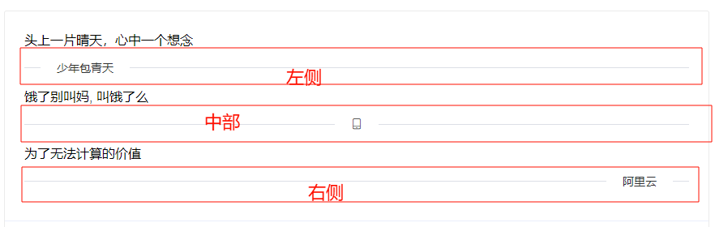

# 注意事项

1. 没有直接设置垂直或水平属性,可以通过设置宽度和高度来达到,`例如width>height就是水平方向,反之为垂直方向`,如需设置自行计算
2. 当`内容是图标时需要设置组件的高度为图标的高度否则图标不会显示`,此时若需要设置两侧线的高度设置属性`lineHight`即可(不可单独设置,两线统一)
3. 若只需显示一条水平线或垂直线可以设置属性`onlyDisplayOneLine=true`或者自行定义一个矩形(宽高根据需要设置)
4. 默认两线高度为1

# 属性

>iconSource:url

图标源

>iconSize:size

图标的大小,`默认为32*32`

>text:string

文本内容,`默认为这是文本`

>textColor:color

文本内容的颜色,`默认为黑色`

>textFont:font

文本字体

>type:enum

内容类型,分为文本或图标,`默认为文本`

值:
1. ExDivider.DisplayType.Text 文本
2. ExDivider.DisplayType.Icon 图标

>margin:real

内容和两线的间距,`默认为10`

>contentPosition:enum

内容的位置,分为左侧,中部,右侧.`默认为左侧`

值:
1. ExDivider.Position.Left 左侧
2. ExDivider.Position.Center 中部
3. ExDivider.Position.Right 右侧

>leftLineColor:color

左侧线条的颜色,`默认为#DCDFE6`

>rightLineColor:color

右侧线条的颜色,`默认为#DCDFE6`

>lineHeight:real

左右线的统一高度.`默认为1`

>onlyDisplayOneLine:bool

设置为true则只显示一条直线,反之显示文本/图标+线条

>leftLineWidth:real

左侧线条的宽度,`默认为20`

