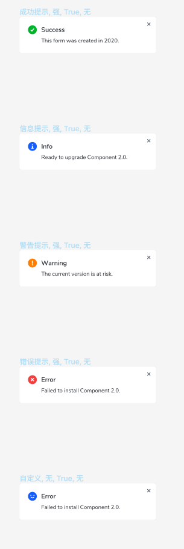
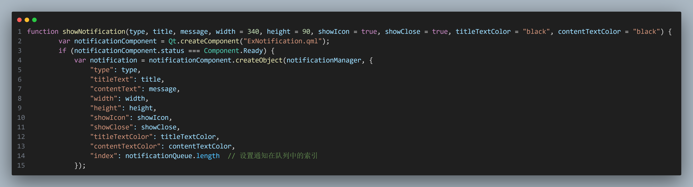

# 注意事项

1. 除了`ExNotificationManager`里的`showNotification`函数的参数之外,其余的`ExNotification`的属性被写死了,若你的通知组件的ui布局不同直接修改`ExNotification`里的属性
    1. PS:以后再优化先用着吧...
2. ui原型图如下
    

3. `showNotification`需要的参数如下
    